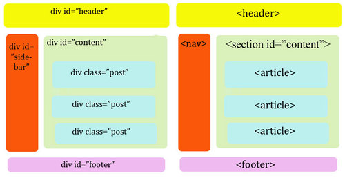

# html5

html4에서는 html태그가 문서 내용들을 화면에 보여주는 역활만 했기때문에 화면을 구성하는 역활은 대부분 `<div>` 태그가 맡았고 수많은 `<div>` 태그들은 다시 `id` 속성을 부여해서 구분했습니다.

이러한 방법은 문서 구조를 이해하기에 많은 시간이 걸리고 시각장애인 낭독기(screen reader)나 검색엔진에서 웹소스를 읽은때도 어느 부분이 메뉴이고 본문인지 구별할 수 없었습니다.

이러한 이유때문에 html5 표준안에서는 문서 구조를 만드는 시맨틱 태그가 등장했습니다.

시맨틱 태그(semantic tag)란 의미론적인 또는 의미가 통하는 뜻으로 태그 자체가 어떤 역활을 하는지 정해놓은 것입니다.

아래의 그림은 html4에서 사용하던 `<div>` 태그에 `id`속성을 부여했던것과 html5에서 추가된 시맨틱 태그를 비교한 것입니다.


<!--  -->


## 문서 구조를 위한 HTML5 시맨틱 태그

- `<header>` 태그 - 머리말 지정하기

`<header>` 태그는 특정 부분의 머리말(header)에 해당합니다. 

위치는 주로 상단이나 왼쪽에 배치되는 경우가 많고 `<form>>`태그나 `<nav>` 태그를 포함하기도 합니다.


```html
<header>해더영역</header>
```


- `<nav>` 태그 - 문서를 연결하는 네이게이션 링크

네비게이션 역활을 하는 `<nav>`태그는 동일한 사이트 안의 문서나 다른 사이트의 문서로 연결하는 링크 모음으로 사용합니다.

`<nav>`태그는 네비게이션 역활 뿐만 아니라 푸터에 있는 사이트 링크 모음 부분에도 많이 사용됩니다. 위치에 영향을 받는것이 아니기 때문에 `<header>`, `<footer>`, `<aside>` 태그안에 여러번 사용할 수도 있습니다.

```html
<nav>
    <ul>
        <li><a href="#">menu1</a></li>
        <li><a href="#">menu2</a></li>
        <li><a href="#">menu3</a></li>
    </ul>
</nav>
```


- `<section>` 태그 - 주제별 콘텐츠 영역 나타내기

`<section>` 태그는 문맥 흐름중에서 컨텐츠를 주제별로 묶을 때 사용하며 그 안에는 섹션 제목을 나타내는 `<h1>~<h6>` 제목 태그가 함께 사용되며, `<section>` 태그안에 `<section>` 태그를 넣을 수도 있습니다.

모질라 사이트를 보면 섹션 별로 주제를 나누어서 표시한걸 볼 수 있습니다.

[모질라 사이트 예제보기](https://www.mozilla.org/ko/)

```html
<section>.....</section>
<section>.....</section>
<section>.....</section>
```


- `<article>` 태그 - 컨텐츠 내용 넣기

`<article>` 태그는 article의 사전적 의미가 신문이나 잡지의 기사를 뜻하는 것으로 웹상의 실제 내용을 넣습니다. 보통 블로그의 포스트나 웹사이트이 내용, 사용자가 등록한 코멘트, 독립적인 웹 컨텐츠 항목이 해당됩니다.

즉 독립적으로 배포하거나 재사용하더라도 완전히 하나의 컨텐츠가 된다면 `<article>` 태그를 씁니다.

보통 `<section>` 태그와 `<article>` 태그를 혼동하기도 하는데 `<section>` 태그는 문맥 흐름상 컨텐츠를 주제별로 묶을때 사용합니다.

`<article>` 태그안에 `<section>` 태그를 넣을수도 있습니다.


- `<aside>` 태그 - 본문 이외의 내용 표시하기

사이트의 왼쪽이나 오를쪽에 위치시켜 사용하고, 필수요소가 아니기 때문에 링크모음이나 광고 등 문서의 메인 내용에 영향을 미치지 않는 내용들을 넣을때 사용합니다.

```html
<article>
    <section>.....</section>
    <aside>.....</aside>
</article>
```


- `<footer>` 태그 - 제작 정보와 저작권 정보 표시하기

일반적으로 웹 문서 하단에 들어가는 `<footer>` 태그는 사이트 제작자의 연락처 정보나 저작권 정보를 표시합니다.

또한 `<footer>` 태그안에는 `<header>, <section>, <article>` 등 다른 레이아웃 태그들도 사용할 수 있습니다.

```html
<footer>......</footer>
```


- `<address>>` 태그 - 사이트 제작자 정보, 연락처 정보 나타내기

`<address>>` 태그는 주로 `<footer>>`태그 안에 사용되는데 웹페이지의 제작자의 이름이나 연락처 정보를 넣은데 사용합니다.

```html
<footer>
    <strong>제작자이름</strong>
    <address>주소: ....</address>
</footer>
```


### IE8 이하버젼 대응하기

html5에서 추가되는 태그나 css3 속성들은 지원하지 않기 때문에 특별히 지정을 해줘야 합니다.

css 에서 시맨틱 태그를 블럭처리하거나 자바스크립트로 시맨틱 태그 요소를 새로 생성하는 방법이 있습니다만 번거롭습니다.

그래서 간단이 html5shiv.js 파일을 로드하는 방법을 많이 이용합니다.

IE8 이하 버젼만 적용되면 되므로 아래처럼 `<head>`태그 사이에 넣어줍니다.

```html
<head>
    ....
    <!-- [if lt IE 9>
        <script src="https://cdnjs.cloudflare.com/ajax/libs/html5shiv/3.7.3/html5shiv.min.js"></script>
    <![endif] -->
</head>
```


